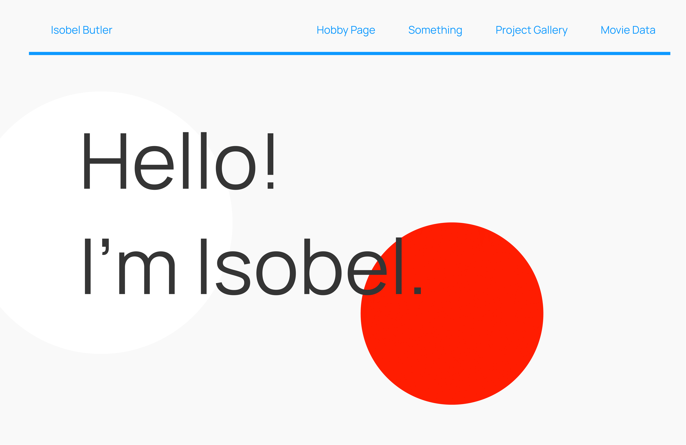
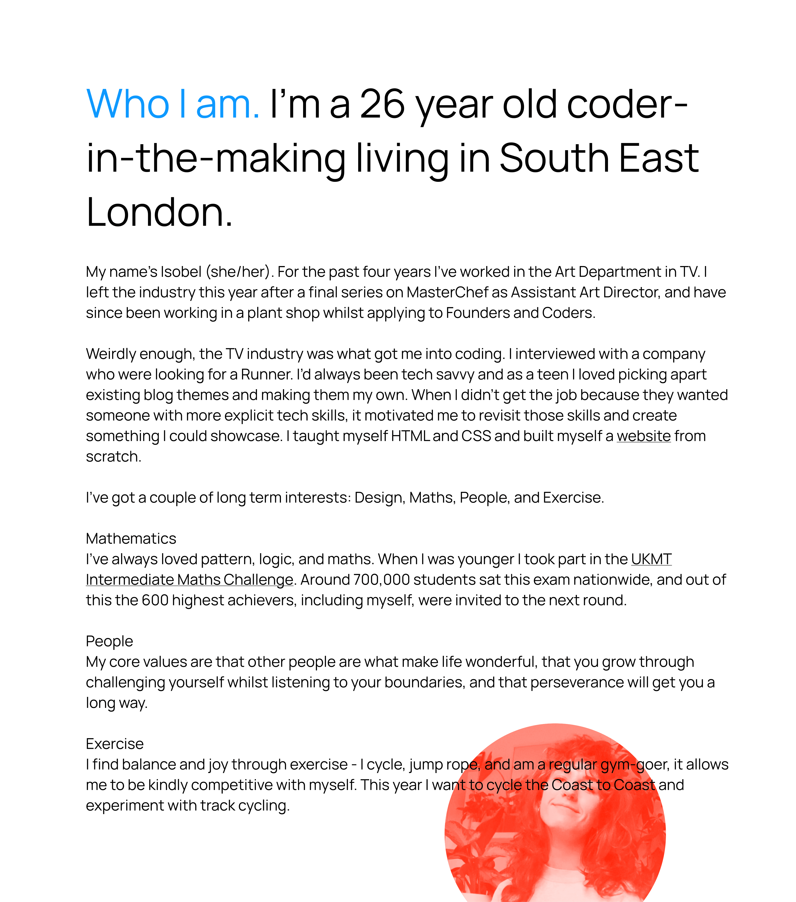
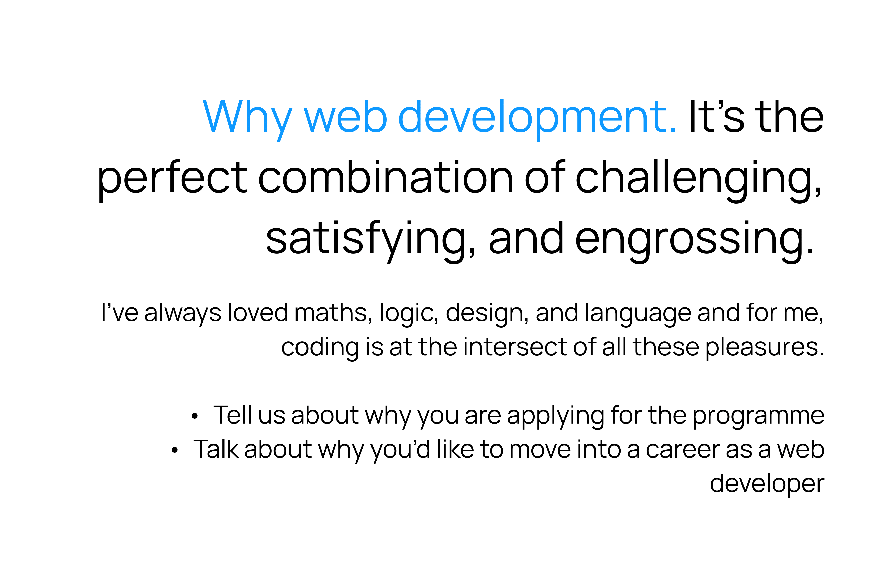

# Application Website

## Table of Contents
1. [Planning](#Planning)  

  a. [Colour Palettes](#colour-palettes)  
  b. [Figma Design](#original-figma-design) 

2. [Building](#Building)  
3. [Debugging](#Debugging)

## Planning

Before starting the build of this site I chose a colour palette and created an initial design on Figma. I wanted something quite simple, with strong accent colours to keep the page interesting. The actual design of the site took a U-turn after I'd already built it. I wasn't happy with the original design and felt like the strong accent colours weren't particularly reflective of who I am. I decided to go for a softer, more tonal palette, yet still with one strong accent colour. I was pleased with this redesign as it felt more inviting and personal, rather than the original choices which in hindsight feel quite cold and corporate.

To find colours, I either use coolors.co or I browse websites and use an app called ColorSlurp to pick out and save colours I like. It means when I go to change a palette, I've already got a whole selection to choose from.

### Colour Palettes
#### First Design:
| Use             | Colour/Hex                                                                |
| ----------------- | ------------------------------------------------------------------ |
| Main Background |  #F9F9F9 |
| Background Accent |  #FE1E00 |
| Headings |  #1099FF |
| Main Text |  #000000 |


#### Final Design:
| Use             | Colour/Hex                                                                |
| ----------------- | ------------------------------------------------------------------ |
| Section Background |  #F2F2EF |
| Section Background |  #E9E7E2 |
| Section Background |  #231F20 |
| Main Accent |  #FE4631 |
| Accent |  #ECB08B |
| Main Text |  #1A1A1A |

### Original Figma Design:






## Building

1. Add skeleton HTML and CSS to recreate Figma Design.
2. Add pseudo-element background shapes and selfie.
3. Create responsive navbar.
4. Style redesign.
    - Change main fonts.
    - Edit layout.
    - Remove pseudo element selfie.
    - Change the entire colour palette.
5. Added a static section about my interests.
6. Added CSS animations.
6. Changed interests section to be more interactive using mouseovers which hide/show divs.
7. Tweak copy for all sections.
8. Add media queries.
9. Merge the project gallery.
    - This had previously been a different site with a different design, but I thought it would be nice to include it in the main site.
10. Add extra media queries to improve fonts on mobile.
    - I found on my phone the fonts were appearing different to Chrome DevTools.


## Debugging

### Issue: Getting the interests section mouseover event handler working properly.


**Original code:**
```javascript


```

**Solution:**

```javascript

```

### Issue: Getting interests section to appear nicely on mobiles.


**Original code:**
```javascript


```

**Solution:**

```javascript

```
